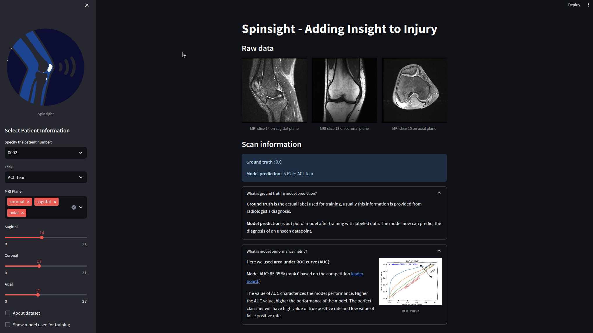

# MRNet-app
AI prototype of Spinsight MRI

Here, the implementation of MRNet[1] is presented through an app written using streamlit.
To check the streamlit app run the following line of code in your terminal:
```
streamlit run MRNet_app.py
```

The following image
provides a demo of MRNet app illustrating the slices of axial, coronal, and sagittal images.



For training the MRNet and to be able to produce the image above, please download the data from [2], and 
save it in 'data' folder.
Run the 'main' file to train the MRNet model.

# References
1- [MRNet](https://stanfordmlgroup.github.io/projects/mrnet/)

2- [Dataset](https://stanfordmlgroup.github.io/competitions/mrnet/)

[//]: # (2- Fully automated and robust analysis technique for popliteal artery vessel wall evaluation [&#40;FRAPPE&#41;]&#40;https://onlinelibrary.wiley.com/doi/abs/10.1002/mrm.28237&#41; using neural network models from standardized knee MRI.)
